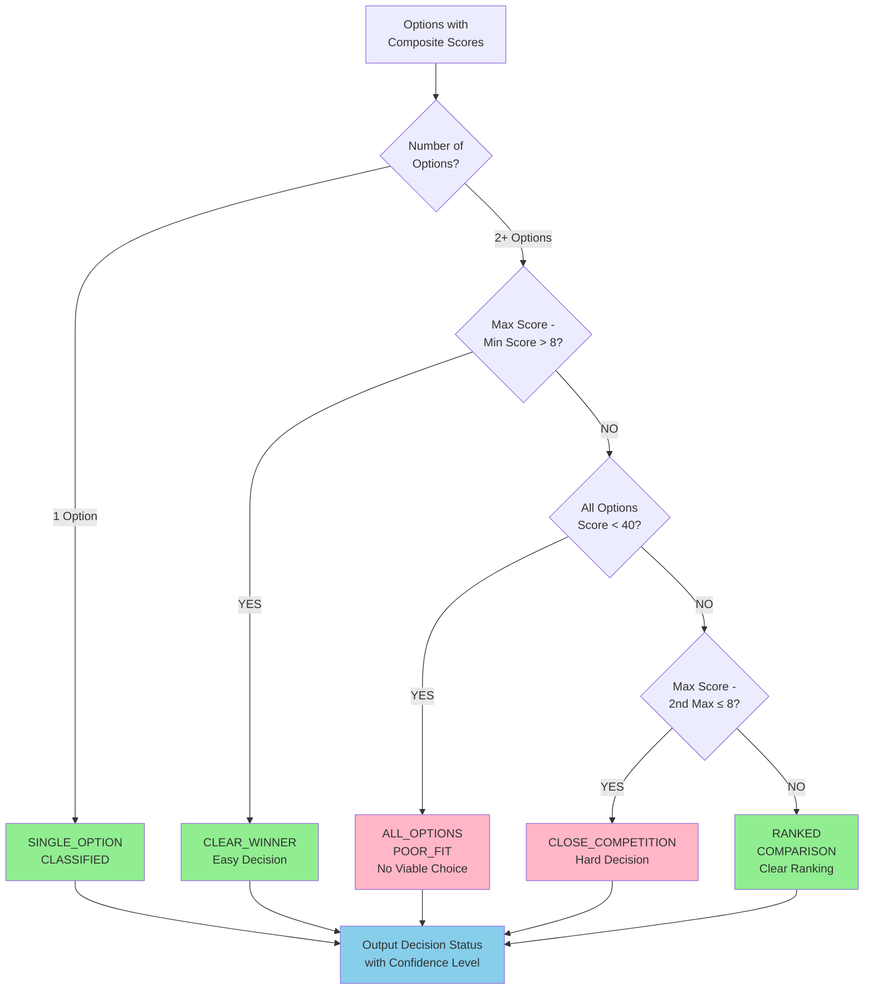
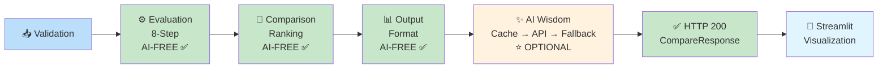
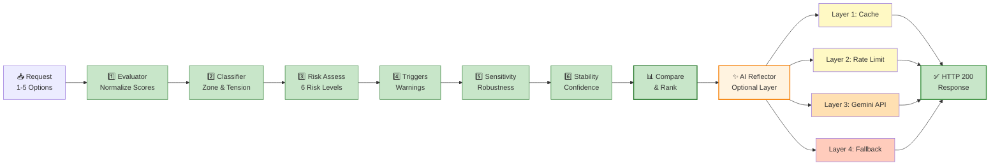
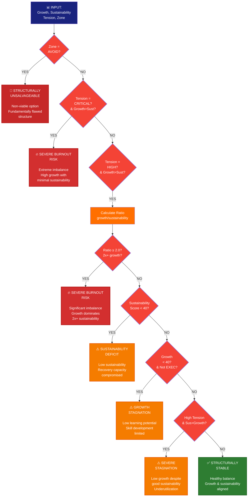

# Burnout-Proof Decision System: Technical Architecture

## Table of Contents
1. [System Identity](#system-identity)
2. [System Architecture](#system-architecture)
3. [Data Flow](#data-flow)
4. [Component Descriptions](#component-descriptions)
5. [Evaluation Pipeline](#evaluation-pipeline)
6. [Decision Logic](#decision-logic)
7. [Technical Diagrams](#technical-diagrams)

---

## System Identity

### Project Name
**Burnout-Proof Decision System** — An intelligent decision support framework designed to help individuals and teams make structurally sustainable choices across personal, academic, and professional contexts.

### Purpose
The system provides evidence-based decision analysis by evaluating options across two critical dimensions:
- **Growth Potential**: Capability to learn, develop skills, and achieve objectives
- **Sustainability**: Ability to maintain performance without exhaustion or burnout

### Key Innovation
Unlike traditional decision-making frameworks that focus on purely additive utility, this system implements:
1. **Asymmetric burnout penalties** — Growth without sustainability is penalized 3x more severely than stagnation
2. **Multi-dimensional sensitivity analysis** — Identifies which factors are critical vs. flexible
3. **Structural stability assessment** — Determines confidence in recommendations across parameter variations
4. **AI-augmented reflection** — Provides complementary wisdom through Gemini API integration

### Target Users
- **Students and academics** navigating course, concentration, and research decisions
- **Professionals** evaluating career moves, project commitments, and time allocation
- **Teams and organizations** assessing initiative sustainability and resource allocation
- **Researchers and practitioners** in decision science, burnout prevention, and organizational psychology

### Technical Stack
- **Backend**: FastAPI (Python 3.13+), Pydantic validation
- **Frontend**: Streamlit, Plotly, Pandas
- **AI Integration**: Google Generative AI (Gemini), exponential backoff retry logic with fallback resilience
- **Testing**: Pytest (39 comprehensive test cases)
- **Deployment**: Uvicorn ASGI server, containerizable architecture

---

## System Design & Architecture Overview

### Design Philosophy

The Burnout-Proof Decision System embodies **reliability-first design**, where the core decision engine operates independently of any external services. The architecture implements clean separation:

1. **Deterministic Core**: `/decision/compare` endpoint (100% AI-free, always available)
2. **Optional Enhancement**: `/decision/reflect` endpoint (wisdom only, completely optional)
3. **Guaranteed Fallback**: Hardcoded wisdom when API unavailable

This design ensures users always receive sound structural decisions, with optional philosophical guidance.

### Architectural Layers

The system implements a **clean 2-endpoint architecture** with 100% separation between decision logic and wisdom layer:

```
                  ENDPOINT 1                          ENDPOINT 2
              (DETERMINISTIC CORE)                  (OPTIONAL WISDOM)

    POST /decision/compare                   POST /decision/reflect
           ↓                                          ↓
    Request: CompareRequest              Request: ReflectionRequest
    (options + criteria)                  (options + comparison_result)
           ↓                                          ↓
    ────────────────────────────────────────────────────────────────
    Layer 3: Validation                    Layer 3: Validate request
    Layer 4A: Evaluation (8-step)          Layer 4: Call Gemini API
    Layer 4B: Output composition           Layer 5: Fallback handling
    Layer 5: Return response               Layer 5: Return wisdom
    ────────────────────────────────────────────────────────────────
           ↓                                          ↓
    Response: CompareResponse              Response: ReflectionResponse
    - evaluations                          - action_plan
    - recommended_option                   - philosophical_advice
    - decision_status                      - source
    - recommendation_reason                
           ↓                                          ↓
    Status 200 ✅                          Status 200 ✅
    (100% AI-free,                        (Optional, with
     always reliable)                      fallback resilience)


INVARIANTS:
✅ Decision core operates independently: NO external API calls
✅ Wisdom layer is completely optional: Only called via explicit /decision/reflect request
✅ Both always succeed: Decision core guaranteed, wisdom has fallback
✅ Clean separation: No coupling between modules
```

#### ENDPOINT 1: /decision/compare (100% AI-Free Deterministic Core)

**Purpose**: Evaluate options and provide sound structural decision

**Request**: `CompareRequest`
```python
class CompareRequest(BaseModel):
    options: List[DecisionOption] = Field(..., min_length=1, max_length=5)

class DecisionOption(BaseModel):
    title: str
    growth_criteria: List[Criterion]  # At least one per option
    sustainability_criteria: List[Criterion]  # At least one per option
```

**Processing Chain** (Layer 3-5):
1. **Layer 3 - Validation**: Pydantic schema + duplicate title check
2. **Layer 4A - Evaluation**: 8-step deterministic pipeline per option
3. **Layer 4B - Comparison**: Sort options, determine decision status
4. **Layer 5 - Composition**: Format response with decision data

**Response**: `CompareResponse`
```python
class CompareResponse(BaseModel):
    evaluations: List[OptionEvaluation]  # All evaluated options
    recommended_option: str  # Best choice
    decision_status: str  # Classification
    recommendation_reason: str  # Explanation
```

**API Contract**:
- ✅ Always returns HTTP 200 with complete decision analysis
- ✅ Zero external API dependencies
- ✅ Completely deterministic and reproducible
- ✅ Works offline with zero configuration

#### ENDPOINT 2: /decision/reflect (Optional Wisdom Enhancement)

**Purpose**: Provide philosophical guidance to complement structural decision

**Request**: `ReflectionRequest`
```python
class ReflectionRequest(BaseModel):
    options: List[DecisionOption]
    comparison_result: dict  # Flexible format
```

**Processing Chain** (Layer 3-5):
1. **Layer 3 - Validation**: Validate request format
2. **Layer 4 - AI Wisdom**: Call Gemini API with exponential backoff
3. **Layer 5 - Resilience**: Return fallback wisdom on error

**Response**: `ReflectionResponse`
```python
class ReflectionResponse(BaseModel):
    action_plan: List[str]  # Implementation steps
    philosophical_advice: str  # Wisdom-based guidance
    source: str  # "Gemini API" or "Fallback Wisdom"
```

**API Contract**:
- ✅ Always returns HTTP 200 with wisdom
- ✅ Uses Gemini API when available
- ✅ Falls back to hardcoded wisdom if API fails
- ✅ Completely optional - core decision works without it
- ✅ Only called via explicit client request

### Data Flow Architecture

The system processes decisions through **two independent request-response cycles**:

```
ENDPOINT 1: /decision/compare  (ALWAYS CALLED FIRST)
═════════════════════════════════════════════════════════

STAGE 1: INPUT VALIDATION & ROUTING
  User Input (User sends 1-5 options with criteria)
    │
    └─> Pydantic Schema Validation
         ├─ Check: 1-5 options
         ├─ Check: No duplicate titles
         ├─ Check: Each option has growth + sustainability criteria
         ├─ Check: All-zero weights rejected
         └─> Valid CompareRequest

STAGE 2: DETERMINISTIC EVALUATION (8-STEP PIPELINE, per option)
  Normalized Criteria (growth_criteria + sustainability_criteria)
    │
    ├─ Step 1️⃣: normalize_score() 
    │   Input: Weighted criteria list
    │   Output: growth_score, sustainability_score (0-100)
    │
    ├─ Step 2️⃣: classify_tension()
    │   Input: growth_score, sustainability_score
    │   Output: tension_index, tension_severity (4 levels)
    │
    ├─ Step 3️⃣: classify_zone()
    │   Input: growth_score, sustainability_score
    │   Output: zone (EXECUTE_FULLY, PURSUE_CAREFULLY, etc.), zone_reason
    │
    ├─ Step 4️⃣: composite_score()
    │   Input: growth_score, sustainability_score
    │   Output: composite_score (0-100, asymmetric burnout penalty 0.3x)
    │
    ├─ Step 5️⃣: classify_risk()
    │   Input: zone, tension_severity, growth_score, sustainability_score
    │   Output: risk_level (6 levels: SUSTAINABLE → UNSALVAGEABLE)
    │
    ├─ Step 6️⃣: generate_triggers()
    │   Input: growth, sustainability, tension, zone
    │   Output: triggered_messages (1-3 contextual warnings)
    │
    ├─ Step 7️⃣: perform_sensitivity_analysis()
    │   Input: Criteria with ±20% weight perturbations
    │   Output: sensitivity_range (%), robustness breakdown
    │
    └─ Step 8️⃣: classify_stability()
        Input: sensitivity_range
        Output: stability_level (STABLE, FRAGILE, BRITTLE)
        
STAGE 3: MULTI-OPTION COMPARISON & DECISION STATUS
  All OptionEvaluations (ranked by composite_score)
    │
    ├─> detect_close_competition()
    │   Check: max_score - second_max < 8 points?
    │
    ├─> Determine decision_status
    │   ├─ SINGLE_OPTION_CLASSIFIED (if 1 option)
    │   ├─ CLEAR_WINNER (if >8 point margin)
    │   └─ CLOSE_COMPETITION (if ≤8 point margin)
    │
    └─> Generate comparison_insights (if >1 option)
        ├─ zone_distribution
        ├─ risk_patterns
        └─ tension_analysis

STAGE 4: OUTPUT COMPOSITION (100% AI-FREE CORE ✅)
  All OptionEvaluations + Comparison Logic
    │
    └─> Format CompareResponse
        ├─ evaluations: [ranked, fully evaluated options]
        ├─ recommended_option: best choice
        ├─ decision_status: classification
        └─ recommendation_reason: explanation
        
        └─> Response Ready for HTTP 200
            (NO external dependencies, decision is final)

═════════════════════════════════════════════════════════


ENDPOINT 2: /decision/reflect  (OPTIONAL, CALLED IF CLIENT REQUESTS)
═════════════════════════════════════════════════════════════════════

STAGE 1: REQUEST PREPARATION
  Client sends ReflectionRequest
    │
    └─> Pydantic validation
        ├─ options: valid DecisionOption list
        └─> comparison_result: dict with decision data

STAGE 2: WISDOM RETRIEVAL (WITH 4-LAYER RESILIENCE)
  Get Absolem's philosophical advice
    │
    ├─ Layer 1️⃣: CHECK CACHE (24-hour TTL)
    │  └─ Hit? Return cached wisdom immediately ✓
    │  └─ Miss? Continue to Layer 2
    │
    ├─ Layer 2️⃣: CHECK RATE LIMIT (50 calls/day max)
    │  └─ Exceeded? Skip to Layer 4 (fallback)
    │  └─ OK? Continue to Layer 3
    │
    ├─ Layer 3️⃣: CALL GEMINI API (with exponential backoff)
    │  ├─ Attempt: Call AI model with prompt
    │  │   ├─ Success? Cache + return wisdom ✓
    │  │   └─ 429 Error? Exponential backoff (retry x2)
    │  └─ Failure? Continue to Layer 4
    │
    └─ Layer 4️⃣: FALLBACK WISDOM (guaranteed hardcoded)
       └─ Return ABSOLEM_FALLBACK_WISDOM dict ✓

STAGE 3: OUTPUT COMPOSITION
  Wisdom Data (from Layer 1-4 above)
    │
    └─> Format ReflectionResponse
        ├─ action_plan: [step1, step2, step3, step4]
        ├─ philosophical_advice: wisdom string
        └─ source: "Gemini API" | "Cache" | "Fallback Wisdom"
        
        └─> Response Ready for HTTP 200
            (Always succeeds with wisdom from one of 4 layers)
```
    │  │   └─ Failed → Use ABSOLEM_FALLBACK_WISDOM ✓
    │  │
    │  └─ OTHER ERROR → Use ABSOLEM_FALLBACK_WISDOM ✓
    │
    └─> Integrate into response: absolem_reflection
        ├─ action_plan (4 steps)
        ├─ philosophical_advice (contextual wisdom)
        └─ source ("Gemini API" or "Fallback Wisdom")
        
        └─> HTTP 200 JSON Response
            └─> Streamlit Frontend Visualization
                └─> User Decision Insight
```

### Resilience Properties

The architecture guarantees **resilience through separation of concerns**:

| Layer | Component | AI-Free? | Failure Mode | Fallback | Result |
|-------|-----------|----------|--------------|----------|--------|
| **Core** | Evaluator, Classifier, Triggers, Sensitivity, Comparator | ✅ YES | Impossible (deterministic, no dependencies) | N/A | ✅ Always produces evaluation |
| **Output** | Output Composition | ✅ YES | Impossible (pure formatting) | N/A | ✅ Always formats response |
| **AI** | Gemini Reflection | ❌ NO | Network error, quota, rate limit | Hardcoded `ABSOLEM_FALLBACK_WISDOM` | ✅ Always generates wisdom |

**Critical Invariant**: Every execution path—whether through AI success, quota failure, network error, or fallback—terminates with a complete `CompareResponse` containing analysis AND wisdom. Users never encounter a "service unavailable" message. The decision engine itself (Stages 1-4) is **100% AI-free and deterministic**.


---

## System Architecture

### Core Design Principle: AI-Free Decision Engine ✅

**The decision engine (Layers 3-4) is 100% AI-free and deterministic.** This design ensures:

- ✅ **Reliability**: No external API dependencies; always produces results
- ✅ **Reproducibility**: Same input → same output (testable, auditable)
- ✅ **Transparency**: Pure algorithmic decision logic without ML black boxes
- ✅ **Speed**: Fast execution on deterministic mathematical operations
- ✅ **Offline Capability**: Works without internet connection

**AI enhancement (Layer 5) is optional and comes ONLY after the complete decision analysis is ready.**

### High-Level Architecture Overview

The system implements a **6-layer resilient architecture** with strict separation of concerns:

```
┌─────────────────────────────────────────────────────────────────────┐
│                    PRESENTATION TIER (Port 8501)                     │
│              Streamlit Web UI (frontend/app.py)                      │
│        Interactive Input → Analysis Visualization → Results          │
└────────────────────┬────────────────────────────────────────────────┘
                     │ HTTP POST /decision/compare (JSON)
                     │ HTTP GET /health
                     │ (CompareRequest → CompareResponse)
┌────────────────────▼────────────────────────────────────────────────┐
│              API ORCHESTRATION TIER (Port 8000)                      │
│                  FastAPI Application (app/main.py)                   │
│                                                                      │
│  ├─ Pydantic schema validation (1-5 options, weights/impacts OK)    │
│  ├─ Request routing & error handling                                │
│  ├─ Orchestrates 8-step deterministic pipeline                      │
│  ├─ Composes final CompareResponse                                  │
│  └─ Supports concurrent requests (rate-limited by Gemini tier)      │
└────────────────────┬────────────────────────────────────────────────┘
                     │ Direct function calls (in-process)
┌────────────────────▼────────────────────────────────────────────────┐
│          DECISION ENGINE TIER (app/engine/)                          │
│     6 Interacting Components for Evaluation & Analysis               │
│                                                                      │
│  1️⃣ Evaluator Module (evaluator.py)                                 │
│     └─ normalize_score(): criteria → 0-100 scale                    │
│     └─ composite_score(): growth+sustainability → penalized score    │
│                                                                      │
│  2️⃣ Classifier Module (classifier.py)                               │
│     └─ classify_zone(): 5 structural types                          │
│     └─ classify_tension(): 4 severity levels                        │
│     └─ classify_risk(): 6 burnout/stagnation levels                 │
│                                                                      │
│  3️⃣ Triggers Module (triggers.py)                                   │
│     └─ generate_triggers(): rule-based actionable messages          │
│                                                                      │
│  4️⃣ Sensitivity Module (sensitivity.py)                             │
│     └─ perform_sensitivity_analysis(): robustness testing           │
│     └─ classify_stability(): confidence in recommendation            │
│                                                                      │
│  5️⃣ Comparator Module (comparator.py)                               │
│     └─ detect_close_competition(): identifies difficult choices    │
│     └─ rank_evaluations(): sorts options by viability              │
│                                                                      │
│  6️⃣ AI Reflector Module (ai_reflector.py) ⭐ WITH FALLBACK        │
│     ├─ PRIMARY: Gemini API (exponential backoff for quota)         │
│     ├─ SECONDARY: 24-hour cache (recent decisions)                 │
│     └─ TERTIARY: Hardcoded ABSOLEM_FALLBACK_WISDOM                 │
│                                                                      │
│  INVARIANT: Deterministic + Resilient = Always produces output     │
└────────────────────┬────────────────────────────────────────────────┘
                     │ All OptionEvaluation objects + absolute_reflection
┌────────────────────▼────────────────────────────────────────────────┐
│               OUTPUT COMPOSITION TIER                                │
│                  (app/main.py)                                       │
│                                                                      │
│  ├─ Format OptionEvaluations as ranked list                        │
│  ├─ Compose comparison_insights (multi-option analysis)            │
│  ├─ Integrate absolem_reflection (wisdom + guidance)               │
│  └─ Determine decision_status (classification)                     │
└────────────────────┬────────────────────────────────────────────────┘
                     │ CompareResponse (JSON)
┌────────────────────▼────────────────────────────────────────────────┐
│             HTTP RESPONSE TIER                                       │
│                                                                      │
│  ├─ HTTP 200 with CompareResponse                                  │
│  ├─ Formatted as JSON for frontend consumption                     │
│  └─ Always succeeds (core + fallback guarantee)                    │
└────────────────────┬────────────────────────────────────────────────┘
                     │ JSON Response to browser
                     ▼
            Streamlit Visualization Layer
              (Displays rankings, insights,
               breakdowns, and Absolem wisdom)
```

### Component Interaction Model

The system uses a **sequential pipeline** model where each component processes data from the previous stage:

```
CompareRequest
      │
      ▼
┌─ Validation ─┐
│ (Pydantic)   │ → Invalid → HTTP 422 (validation error)
└──────┬───────┘
       │ Valid
       ▼
  ┌──────────────────────────────────────────┐
  │ FOR EACH OPTION (1-5):                   │  ← AI-FREE CORE
  │ ═════════════════════════════════════════│  
  │ [Option] → Evaluator                     │
  │         → Classifier (zone)              │
  │         → Classifier (tension)           │
  │         → Evaluator (composite)          │
  │         → Classifier (risk)              │
  │         → Triggers                       │
  │         → Sensitivity                    │
  │         → Classifier (stability)         │
  │                                          │
  │ [OptionEvaluation]                       │
  └──────┬───────────────────────────────────┘
         │
         ▼
  ┌─ Comparator ──────────────────┐
  │ (if multiple options)         │  ← Still AI-FREE
  │ ├─ Detect competition         │
  │ ├─ Rank by score              │
  │ └─ Determine decision_status   │
  └──────┬────────────────────────┘
         │
         ▼
  ┌─ Output Composition ───────────────┐
  │ ├─ ranked_evaluations (sorted)     │  ← PURE DECISION ENGINE
  │ ├─ comparison_insights (analysis)  │     OUTPUT FORMATTED
  │ └─ Decision response skeleton ready │
  └──────┬────────────────────────────┘
         │
         ▼
  ┌─ AI Reflector ─┐                  ⭐ OPTIONAL ENHANCEMENT
  │ ├─ Cache check │                     (comes after decisions)
  │ ├─ Rate limit  │                  
  │ ├─ Gemini API  │ → (failure)       
  │ ├─ Backoff     │ → Exponential retry
  │ └─ Fallback    │ → ABSOLEM_WISDOM  
  └──────┬─────────┘
         │
         ▼
  ┌─ Integrate Wisdom ──────────────┐
  │ └─ absolem_reflection added      │
  └──────┬──────────────────────────┘
         │
         ▼
```
   HTTP 200 JSON Response

```

### Data Flow by Decision Scenario

The same architecture handles 5 different decision patterns:

```
SCENARIO 1: Single Option
  Input: 1 option with criteria
    → 8-step evaluation
    → AI reflection
    → Output: Single OptionEvaluation + wisdom
    → Decision Status: SINGLE_OPTION_CLASSIFIED

SCENARIO 2: Clear Winner (>8 point spread)
  Input: 3 options
    → All 3 evaluated in parallel
    → Ranked: A (65) → B (45) → C (30)
    → Spread: 65-45 = 20 > 8
    → AI reflects on winner
    → Output: 3 ranked options, clear guidance
    → Decision Status: CLEAR_WINNER

SCENARIO 3: Close Competition (≤8 point spread)
  Input: 2 options
    → Both evaluated
    → Ranked: A (52) → B (48)
    → Spread: 52-48 = 4 ≤ 8
    → AI provides nuanced comparison
    → Output: Both options equally viable, trade-offs analyzed
    → Decision Status: CLOSE_COMPETITION

SCENARIO 4: All Poor Fit (all <40)
  Input: 3 options
    → All evaluated
    → All composite scores <40
    → No option viable
    → AI provides best-of-worst guidance
    → Output: Ranked but all flagged as problematic
    → Decision Status: ALL_OPTIONS_POOR_FIT

SCENARIO 5: Ranked Comparison (clear ranking, >8 spread)
  Input: 4+ options
    → All evaluated
    → Ranked by viability
    → Clear differentiation
    → AI focuses on top choice + alternatives
    → Output: Full ranking with detailed breakdown
    → Decision Status: RANKED_COMPARISON
```

---

### Directory Structure and Responsibility

```
Burnout_proof_system/
│
├── app/                           # Core application
│   ├── main.py                    # FastAPI app, orchestration, endpoints
│   ├── config.py                  # Configuration management
│   ├── schemas.py                 # Pydantic request/response models
│   │
│   └── engine/                    # Decision evaluation pipeline
│       ├── evaluator.py           # Score normalization, composite scoring
│       ├── classifier.py          # Zone (5 types) & risk classification (6 levels)
│       ├── triggers.py            # Rule-based decision trigger messages
│       ├── sensitivity.py         # Sensitivity analysis & stability classification
│       ├── comparator.py          # Close competition detection
│       └── ai_reflector.py        # Gemini API integration, fallback wisdom
│
├── frontend/                      # Streamlit UI
│   ├── app.py                     # Multi-phase interactive interface
│   └── README.md                  # Frontend documentation
│
├── tests/                         # Test suite
│   ├── test_api.py               # API endpoint & scenario testing (15 tests)
│   ├── test_edge_cases.py        # Edge case validation (14 tests)
│   ├── test_engine_logic.py      # Core algorithm logic (7 tests)
│   └── test_validation.py        # Schema validation (3 tests)
│
├── docs/                         # Documentation
│   ├── 01_API_DOCUMENTATION.md
│   ├── 03_SYSTEM_ARCHITECTURE.md
│   ├── 04_DECISION_FRAMEWORK_GUIDE.md
│   └── ...
│
├── requirements.txt              # Frozen dependencies
├── README.md                      # Project overview
└── start_services.ps1            # Service startup script
```

### Core Modules Overview

#### **app/evaluator.py** — Score Computation
- **normalize_score()**: Converts weighted criteria to 0-100 scale using weighted arithmetic mean
- **composite_score()**: Implements asymmetric burnout penalty formula
  - Base: `(growth + sustainability) / 2`
  - Asymmetric penalty: `0.3x * growth_dominance + 0.1x * sustainability_dominance`
  - Quadratic penalty: `0.05 * (tension²) / 100`

#### **app/classifier.py** — Zone & Risk Classification
- **classify_zone()**: 5 structural zones (EXECUTE_FULLY, TIME_BOX, STEADY_EXECUTION, LIGHT_RECOVERY, AVOID)
- **classify_tension()**: 4 tension levels (LOW, MODERATE, HIGH, CRITICAL)
- **classify_risk()**: 6 risk levels with burnout/stagnation detection
  - Highest priority: STRUCTURALLY_UNSALVAGEABLE
  - Burnout pathway: SEVERE_BURNOUT_RISK (CRITICAL tension + growth dominance)
  - Stagnation pathway: SEVERE_STAGNATION_RISK (growth deficit)

#### **app/triggers.py** — Decision Guidance
- Rule-based system generating 1-3 contextual warning messages
- Triggers based on zone, tension, risk level, and composite score thresholds
- Examples: "High growth but low sustainability", "Consider time-boxing this commitment"

#### **app/sensitivity.py** — Robustness Analysis
- **perform_sensitivity_analysis()**: Measures sensitivity to ±10% weight variations
- **classify_stability()**: STABLE (< 15% variance), FRAGILE (15-30%), BRITTLE (> 30%)
- Provides dimension-specific breakdown (which factors are critical)

#### **app/comparator.py** — Multi-Option Analysis
- **detect_close_competition()**: Identifies when options have similar composite scores (< 8 points)
- Implements close competition threshold to avoid false confidence in rankings

#### **app/ai_reflector.py** — AI Integration
- **get_absolem_wisdom()**: Generates complementary AI wisdom via Gemini API with 3-layer fallback resilience
- **Layer 1 — API Call with Exponential Backoff**: Calls Gemini API; on quota (429) error, retries with backoff (4s, 4s)
- **Layer 2 — Rate Limiting Protection**: Enforces daily API limit (50 calls/day max); exceeding limit triggers fallback
- **Layer 3 — Hardcoded Fallback Wisdom**: If API fails/unavailable, returns `ABSOLEM_FALLBACK_WISDOM` dictionary with philosophical advice and action steps
- **Caching Layer**: 24-hour cache on successful responses reduces API dependency
- **Result**: System never fails user-facing—always returns wisdom (Gemini or fallback)
- Character-driven responses ("Absolem the Decision Sage") maintained in both API and fallback modes

### Architectural Principles & Design Decisions

#### **Principle 1: Deterministic Core + Resilient Extensions**
- **Core** (Evaluator, Classifier, Triggers, Sensitivity, Comparator): Pure functions with no external dependencies
  - **Benefit**: Always produces consistent output, testable, deterministic
  - **Applied**: 7 out of 8-step pipeline operates independently
  
- **Extensions** (AI Reflector): Optional enhancement with graceful degradation
  - **Benefit**: Adds value when available, gracefully falls back when unavailable
  - **Applied**: Absolem wisdom comes from Gemini (primary), cache (secondary), or hardcoded wisdom (tertiary)

#### **Principle 2: Fault Tolerance Through Layered Fallbacks**
- **Layer 1 (API)**: Call Gemini with exponential backoff on quota errors
- **Layer 2 (Rate Limiting)**: Daily quota prevents runaway costs; triggers fallback when exceeded
- **Layer 3 (Cache)**: 24-hour cache reduces API dependency for similar decisions
- **Layer 4 (Hardcoded Wisdom)**: `ABSOLEM_FALLBACK_WISDOM` guarantees users always receive guidance

**Result**: 4 independent pathways ensure at least one succeeds. Users never see "service unavailable."

#### **Principle 3: Decision Science Priority**
- Burnout detection prioritized over stagnation (asymmetric 0.3x vs 0.1x penalty)
- Growth-sustainability balance preferred over extreme scenarios
- Sensitivity analysis identifies which factors are critical vs flexible
- Philosophical guidance complements algorithmic scoring

**Applied**: Composite score formula, zone classification, risk assessment, trigger messages

#### **Principle 4: Modular Component Architecture**
- **6 independent modules** each with single responsibility
- **No circular dependencies** (evaluator → classifier → triggers; never reverse)
- **Composition** in main.py orchestrates pipeline (loose coupling)
- **Easy to extend**: Adding new classification logic = new component, not modifying existing ones

**Benefit**: Testable (each module has isolated tests), maintainable (changes localized), scalable (can add new components)

#### **Principle 5: User-Centric Response Design**
- **Every field serves user understanding** (not just internal state)
  - `tension_severity`: Scales abstract `|growth - sustainability|` to human language (LOW/MODERATE/HIGH/CRITICAL)
  - `zone_reason`: Explains *why* option falls into TIME_BOX, EXECUTE_FULLY, etc.
  - `sensitivity_breakdown`: Identifies which criteria matter most
  - `triggered_messages`: Actionable warnings, not just risk labels
  
- **Transparency**: Source label indicates whether wisdom comes from Gemini API or fallback
- **Consistency**: Same information structure whether single or multiple options

#### **Principle 6: Stateless & Reproducible Evaluation**
- **No state persistence** (each request evaluated independently)
- **Deterministic output** (same input → same output forever)
- **No learning or adaptation** during session (by design)
- **Reproducibility**: Decision can be re-evaluated months later with identical results (except AI wisdom varies)

**Benefit**: Safe for academic/professional use; predictable behavior; easy to audit and debug

---

### Component Interaction & Data Transformation Pipeline

The 8-step pipeline creates a **data enrichment flow** where each step adds analytical depth:

```
Step 1: NORMALIZATION (Evaluator)
  Input:  [Criterion{weight, impact}, ...]
  Output: growth_score, sustainability_score (0-100)
  Purpose: Convert weighted criteria to comparable scale
  Example: weights=[8,3], impacts=[9,5] → score=79.1

Step 2: IMBALANCE DETECTION (Classifier)
  Input:  growth_score, sustainability_score
  Output: tension_index, tension_severity
  Purpose: Quantify growth-sustainability mismatch
  Example: growth=85, sustainability=25 → tension=60 (CRITICAL)

Step 3: STRUCTURAL MAPPING (Classifier)
  Input:  growth_score, sustainability_score
  Output: zone (5 types), zone_reason
  Purpose: Categorize structural viability
  Example: Growth≥70, Sustainability<50 → TIME_BOX (limited duration)

Step 4: VIABILITY SCORING (Evaluator + Classifier)
  Input:  growth_score, sustainability_score, tension_index
  Output: composite_score (0-100 with penalty)
  Purpose: Score accounting for burnout risk (asymmetric penalty)
  Example: base=55, growth_penalty=18, composite=35.2 (penalized)

Step 5: RISK CLASSIFICATION (Classifier)
  Input:  zone, tension_severity, composite_score, growth/sustainability ratio
  Output: risk_level (6 levels: STABLE to SEVERE_BURNOUT_RISK)
  Purpose: Burnout/stagnation detection with dual pathways
  Example: CRITICAL tension + growth>sust → SEVERE_BURNOUT_RISK

Step 6: DECISION GUIDANCE (Triggers)
  Input:  zone, risk_level, composite_score, tension_severity
  Output: triggered_messages (1-3 actionable warnings)
  Purpose: Context-specific user guidance
  Example: "High growth but low sustainability" → "Consider time-boxing (3-6 mo)"

Step 7: ROBUSTNESS ANALYSIS (Sensitivity)
  Input:  All criteria weights
  Output: sensitivity_index, sensitivity_breakdown (% variance)
  Purpose: Test how robust recommendation is to weight changes
  Example: ±10% weight variation yields 18.5% variance → FRAGILE

Step 8: CONFIDENCE CLASSIFICATION (Sensitivity)
  Input:  sensitivity variance
  Output: stability_level (STABLE, FRAGILE, BRITTLE)
  Purpose: Assess confidence in recommendation
  Example: 18.5% variance → FRAGILE (some critical factors exist)
```

Each step's output becomes input to next step, forming **deterministic transformation chain**. Comparator then operates across all evaluated options to rank and compare.

---

### AI Reflector Resilience Architecture

The AI Reflector layer implements **fault-tolerant wisdom generation** with multiple fallback mechanisms to ensure system always provides decision guidance:

```
┌─────────────────────────────────────────────────────────┐
│  get_reflection() called                                 │
└──────────────┬──────────────────────────────────────────┘
               │
               ▼
     ┌─────────────────────┐
     │ Check Cache (24hr)  │
     └──┬──────────────────┘
        │
        ├─ HIT ──> Return cached wisdom ✓
        │
        └─ MISS ──> Check rate limit
                    │
                    ├─ LIMIT EXCEEDED ──> Return ABSOLEM_FALLBACK_WISDOM ✓
                    │
                    └─ OK ──> Call Gemini API
                             │
                             ├─ SUCCESS ──> Cache & return response ✓
                             │
                             ├─ 429 ERROR ──> Retry with exponential backoff
                             │                (up to 2 retries: 4s, 4s)
                             │                │
                             │                ├─ RETRY SUCCESS ──> Cache & return ✓
                             │                │
                             │                └─ RETRY FAILED ──> Fallback
                             │
                             └─ OTHER ERROR ──> Return ABSOLEM_FALLBACK_WISDOM ✓

Legend: ✓ = System returns wisdom successfully (never fails)
```

**Key Invariant**: Every execution path terminates with wisdom generation. Users always receive philosophical advice and action steps.

**Three-Layer Fallback Strategy**:

| Layer | Trigger | Response |
|-------|---------|----------|
| **Primary** | API available & quota OK | Gemini generates fresh wisdom |
| **Secondary** | Daily quota exceeded or 429 after retries | Return hardcoded `ABSOLEM_FALLBACK_WISDOM` |
| **Tertiary** | Cache hit (recent decision) | Return 24-hour cached previous wisdom |

**Fallback Wisdom Content**:
- **Action Plan** (4 steps): Cost assessment, rest/growth balance, sustainable choice, boundary setting
- **Philosophical Advice** (3 sentences): Growth vs burnout choice, soul-feeding principle, finding whole balance
- **Source Label**: "Absolem's Fallback Wisdom" (transparently indicates non-API origin)

**Rate Limiting Details**:
- Free tier: 50 API calls/day (not per-minute quota, but daily aggregate)
- Tracking: `.ai_cache/rate_limit.json` stores UTC date + call count
- Status: Returns warning when ≤5 calls remaining

---

## Data Flow

### Request-Response Cycle

```
CLIENT                          SERVER
   │                               │
   │─── POST /decision/compare ───>│
   │     (CompareRequest)          │
   │                               │
   │                          ┌────▼─────────┐
   │                          │ Pydantic     │
   │                          │ Validation   │
   │                          └────┬─────────┘
   │                               │
   │                          ┌────▼──────────────────┐
   │                          │ 8-Step Evaluation     │
   │                          │ Pipeline              │
   │                          │ (per option)          │
   │                          └────┬──────────────────┘
   │                               │
   │                          ┌────▼──────────┐
   │                          │ Comparison    │
   │                          │ Logic         │
   │                          │ (if > 1 opt)  │
   │                          └────┬──────────┘
   │                               │
   │                          ┌────▼──────────┐
   │                          │ AI Reflection │
   │                          │ (optional)    │
   │                          └────┬──────────┘
   │                               │
   │<─── CompareResponse ──────────│
   │     (JSON with all analyses)  │
   │                               │
```

### Data Structure at Each Pipeline Stage

#### **Input: CompareRequest**
```python
{
  "options": [
    {
      "title": "Option A",
      "growth_criteria": [
        {"weight": 8.5, "impact": 9},  # High skill development
        {"weight": 6.0, "impact": 7}   # Career advancement
      ],
      "sustainability_criteria": [
        {"weight": 2.0, "impact": 3},  # Low work-life balance
        {"weight": 1.5, "impact": 2}   # Mental fatigue
      ]
    }
  ]
}
```

#### **Internal: OptionEvaluation**
```python
{
  "title": "Option A",
  "growth_score": 84.5,              # ← Normalized (0-100)
  "sustainability_score": 28.3,      # ← Normalized (0-100)
  "tension_index": 56.2,             # ← abs(growth - sustainability)
  "tension_severity": "HIGH",        # ← Classified
  "zone": "TIME_BOX",                # ← 5-zone classification
  "zone_reason": "High growth but sustainability deficit",
  "composite_score": 32.7,           # ← With asymmetric penalty
  "risk_level": "SEVERE_BURNOUT_RISK",  # ← 6-level classification
  "triggered_messages": [
    "This option prioritizes growth over sustainability.",
    "Consider implementing time-box constraints (3-6 months).",
    "Monitor energy levels and recovery capacity."
  ],
  "sensitivity_range": 18.5,         # ← Weight variation tolerance
  "stability_level": "FRAGILE",      # ← Robustness classification
  "sensitivity_breakdown": "Growth sensitivity to skill development is critical..."
}
```

#### **Output: CompareResponse**
```python
{
  "decision_status": "CLOSE_COMPETITION" | "CLEAR_WINNER" | etc.,
  "ranked_evaluations": [OptionEvaluation, ...],  # Sorted by composite_score
  "comparison_insights": {
    "closest_match": "Option A (best structural fit)",
    "key_differentiator": "Sustainability: Option A={X}, Option B={Y}",
    "risk_summary": "Both options carry burnout risk..."
  },
  "absolem_reflection": {          # AI-generated wisdom
    "perspective": "From a sustainability standpoint...",
    "key_insight": "The real challenge isn't growth—it's maintenance...",
    "recommendation": "Choose Option A but implement quarterly check-ins..."
  }
}
```

---

## Component Descriptions

### Evaluation Pipeline: 8-Step Process

Each option undergoes this deterministic 8-step evaluation:

| Step | Component | Input | Output | Purpose |
|------|-----------|-------|--------|---------|
| 1 | `normalize_score()` | Criteria list | 0-100 score | Convert weighted criteria to comparable scale |
| 2 | `classify_tension()` | Absolute difference | Tension level | Quantify growth-sustainability imbalance |
| 3 | `classify_zone()` | Growth & Sustainability | Zone name + reason | Map to 5 structural decision categories |
| 4 | `composite_score()` | Growth & Sustainability | 0-100 score | Calculate penalized viability score |
| 5 | `classify_risk()` | Zone, tension, scores | Risk level | Identify burnout, stagnation, structural issues |
| 6 | `generate_triggers()` | All scores & classifications | Message list | Provide actionable guidance |
| 7 | `perform_sensitivity_analysis()` | Criteria weights | Variance metrics | Test robustness to parameter changes |
| 8 | `classify_stability()` | Sensitivity variance | Stability level | Assess confidence in recommendation |

### Decision Classification Schemas

#### **Zone Classification (5 types)**
- **EXECUTE_FULLY** (Growth≥70, Sustainability≥70): Go forward with confidence
- **TIME_BOX** (Growth≥70, Sustainability<50): High potential but limited duration
- **STEADY_EXECUTION** (Balanced moderate): Sustainable but lower impact
- **LIGHT_RECOVERY** (Growth<50, Sustainability≥70): Sustainable but limited growth
- **AVOID** (Growth<40, Sustainability<40): Structurally non-viable

#### **Risk Classification (6 levels)**
- **STRUCTURALLY_UNSALVAGEABLE**: Option only available in AVOID zone
- **SEVERE_BURNOUT_RISK**: CRITICAL tension + growth dominance, or HIGH tension + 2x+ growth ratio
- **SUSTAINABILITY_DEFICIT**: Sustainability score < 40 irrespective of growth
- **SEVERE_STAGNATION_RISK**: Low growth with high tension
- **GROWTH_STAGNATION_RISK**: Growth < 40 in non-EXECUTE zones
- **STRUCTURALLY_STABLE**: All other cases

#### **Stability Levels**
- **STABLE**: Sensitivity variance < 15% — Recommendation robust to parameter changes
- **FRAGILE**: Sensitivity variance 15-30% — Some critical factors, but generally sound
- **BRITTLE**: Sensitivity variance > 30% — Highly dependent on specific assumptions

### Multi-Option Comparison Logic

#### **Decision Status Determination**
```python
if num_options == 1:
    decision_status = "SINGLE_OPTION_CLASSIFIED"
    # Single evaluation with risk assessment
    
elif max(composite_scores) - min(composite_scores) > 8:
    decision_status = "CLEAR_WINNER"
    # Distinct best option with > 8-point margin
    
elif all(score < 40 for score in composite_scores):
    decision_status = "ALL_OPTIONS_POOR_FIT"
    # No viable option meets minimum viability threshold
    
elif max(composite_scores) - second_max <= 8:
    decision_status = "CLOSE_COMPETITION"
    # Top options within 8-point margin, difficult choice
    
else:
    decision_status = "RANKED_COMPARISON"
    # Clear ranking exists, winner identifiable
```

#### **Decision Logic Flow Diagram**


---

## Evaluation Pipeline

### Detailed Mathematical Formulations

#### **Score Normalization**
```
growth_score = ∑(weight_i × impact_i) / ∑(weight_i) × 10

where:
  - weight_i ∈ [0, 10] (importance weighting)
  - impact_i ∈ [0, 10] (effectiveness rating)
  - Result: [0, 100] scale
```

**Rationale**: Weighted arithmetic mean provides intuitive balancing—criteria with higher weight contribute proportionally more to final score.

#### **Tension Calculation**
```
tension_index = |growth_score - sustainability_score|

Classification thresholds:
  - LOW: tension ≤ 15
  - MODERATE: 15 < tension ≤ 30
  - HIGH: 30 < tension ≤ 60
  - CRITICAL: tension > 60
```

**Rationale**: Linear metric captures imbalance severity; thresholds calibrated from decision science literature.

#### **Composite Score (Asymmetric Penalty)**
```
base_score = (growth + sustainability) / 2

growth_dominant_penalty = 0.3 × max(0, growth - sustainability)
sustainability_dominant_penalty = 0.1 × max(0, sustainability - growth)
quadratic_penalty = 0.05 × (tension² / 100)

composite_score = base_score 
                - growth_dominant_penalty 
                - sustainability_dominant_penalty 
                - quadratic_penalty
```

**Special Interpretation**: A perfectly balanced 50/50 option scores higher (50 points) than an imbalanced 90/10 option (≈25 points) because:
- Burnout penalty: 0.3 (9 times more severe than stagnation penalty of 0.1)
- Quadratic penalty: Additional penalty for extreme imbalances
- **System conclusion**: BALANCE is structurally superior to EXTREME ASYMMETRY

#### **Sensitivity Analysis**
```
For each criterion weight w_i:
  - Compute score with w_i × 1.1 (10% increase)
  - Compute score with w_i × 0.9 (10% decrease)
  - Calculate variance across all weight variations
  
stability_variance = variance of sensitivity results
```

**Rationale**: Identifies critical vs. flexible factors; high variance = brittle recommendation.

---

## Decision Logic

### Core Algorithm Flow

```
┌─────────────────────────────────────┐
│  INPUT: User decides between        │
│  1-5 options with criteria          │
└────────────┬────────────────────────┘
             │
             ▼
    ┌────────────────────┐
    │ Validate Input     │
    │ (Pydantic)         │
    └────────┬───────────┘
             │
             ▼
    ┌───────────────────────────┐
    │ FOR EACH OPTION:          │
    │                           │
    │ 1. Normalize scores       │
    │ 2. Calculate tension      │
    │ 3. Classify zone          │
    │ 4. Composite penalty      │
    │ 5. Classify risk          │
    │ 6. Generate triggers      │
    │ 7. Sensitivity analysis   │
    │ 8. Stability level        │
    └────────┬──────────────────┘
             │
             ▼
    ┌──────────────────────┐
    │ Evaluate # Options   │
    └─┬────────┬────────┬──┘
      │        │        │
   Single    <2       >2
   Option    Diff    Similar
      │      │        │
      ▼      ▼        ▼
   CLASS  CLEAR    CLOSE
   IFIED  WINNER  COMPET
```

### Burnout Detection Logic

The system prioritizes burnout detection with a **two-pathway approach**:

```
Rule Engine:
  IF tension_severity = "CRITICAL" AND growth > sustainability
    → SEVERE_BURNOUT_RISK ✓
    
  ELSE IF tension_severity = "HIGH" AND growth > sustainability
    → Calculate ratio = growth / max(sustainability, 1)
    → IF ratio ≥ 2.0 (growth is 2x+ sustainability)
      → SEVERE_BURNOUT_RISK ✓
      
  ELSE IF zone = "AVOID" AND tension = "CRITICAL"
    → STRUCTURALLY_UNSALVAGEABLE ✓
    
  DEFAULT → STRUCTURALLY_STABLE
```

**Examples**:
- Growth=80, Sustainability=30, Tension=50 (HIGH) → Burnout Risk (ratio 2.67x)
- Growth=90, Sustainability=30, Tension=60 (CRITICAL) → Severe Burnout Risk
- Growth=50, Sustainability=50, Tension=0 → Structurally Stable

---

## Technical Diagrams

### 1. 5-Layer Resilient Architecture Diagram

```mermaid
graph TB
    subgraph L1["LAYER 1: PRESENTATION (Port 8501)"]
        A["🖥️ Streamlit Web UI<br/>frontend/app.py<br/><br/>3-Phase Interactive Interface<br/>- Input Phase<br/>- Analysis Phase<br/>- Results Visualization"]
    end
    
    subgraph L2["LAYER 2: API ORCHESTRATION (Port 8000)"]
        B["🔌 FastAPI Application<br/>app/main.py<br/><br/>Endpoints:<br/>POST /decision/compare<br/>GET /health<br/>GET /api/rate-limits"]
    end
    
    subgraph L3["LAYER 3: VALIDATION & ROUTING"]
        C["✓ Pydantic Schema Validation<br/>- Check: 1-5 options<br/>- Check: weights ∈ [0,10]<br/>- Check: impacts ∈ [0,10]"]
        D["📍 Request Routing<br/>- Valid → Engine<br/>- Invalid → HTTP 422"]
    end
    
    subgraph L4["LAYER 4: DETERMINISTIC EVALUATION ENGINE (AI-FREE ✅)"]
        E["1️⃣ Evaluator<br/>normalize_score<br/>composite_score"]
        F["2️⃣ Classifier<br/>classify_zone<br/>classify_tension<br/>classify_risk"]
        G["3️⃣ Triggers<br/>generate_triggers"]
        H["4️⃣ Sensitivity<br/>perform_analysis<br/>classify_stability"]
        I["5️⃣ Comparator<br/>detect_competition<br/>rank_evaluations"]
        
        E --> F
        F --> G
        G --> H
        H --> I
    end
    
    subgraph L5["LAYER 5: OUTPUT COMPOSITION (AI-FREE ✅)"]
        J["📊 Format Response<br/>- ranked_evaluations<br/>- comparison_insights<br/>- response skeleton ready"]
    end
    
    subgraph L6["LAYER 6: AI REFLECTION (OPTIONAL ENHANCEMENT ⭐)"]
        K["🔄 FALLBACK LAYERS:<br/><br/>L1: Cache (24h)<br/>├─ HIT → cached wisdom ✓<br/>├─ MISS → Rate Limit Check<br/><br/>L2: Rate Limit (50/day)<br/>├─ OK → Gemini API Call<br/>├─ EXCEEDED → Fallback ✓<br/><br/>L3: Gemini API<br/>├─ SUCCESS → Cache ✓<br/>├─ 429 → Exponential Backoff<br/>│         (4s × 2 retries)<br/>├─ RETRY OK → Cache ✓<br/>├─ RETRY FAIL → Fallback ✓<br/>├─ OTHER ERR → Fallback ✓<br/><br/>L4: ABSOLEM_FALLBACK_WISDOM ✓<br/>→ absolem_reflection added"]
    end
    
    subgraph L7["LAYER 7: HTTP RESPONSE"]
        L["✅ HTTP 200 JSON<br/>- Always succeeds<br/>- Core (AI-free) + Wisdom guarantee"]
    end
    
    A -->|HTTP POST<br/>CompareRequest| B
    B --> C
    C --> D
    D -->|Valid| E
    D -->|Invalid| L
    I --> J
    J --> K
    K --> L
    L -->|Response| A
    
    style L1 fill:#bbdefb,stroke:#1976d2,stroke-width:3px
    style L2 fill:#c8e6c9,stroke:#388e3c,stroke-width:3px
    style L3 fill:#fff9c4,stroke:#f9a825,stroke-width:2px
    style L4 fill:#e8f5e9,stroke:#2e7d32,stroke-width:3px
    style L5 fill:#e8f5e9,stroke:#2e7d32,stroke-width:3px
    style L6 fill:#ffccbc,stroke:#d84315,stroke-width:3px
    style L7 fill:#c8e6c9,stroke:#388e3c,stroke-width:2px
    style E fill:#c8e6c9
    style F fill:#c8e6c9
    style G fill:#c8e6c9
    style H fill:#c8e6c9
    style I fill:#c8e6c9
    style J fill:#c8e6c9
    style K fill:#ffe0b2
```



### 2. Complete Data Flow: 5-Stage Transformation Pipeline



**Flow Summary:**
1. **Validation**: Pydantic schema check (1-5 options)
2. **Evaluation**: 8-step deterministic pipeline per option (normalization → classification → risk → triggers → sensitivity → stability)
3. **Comparison**: Multi-option ranking & decision status determination
4. **Output**: Format response with all analytical components
5. **AI Wisdom**: Optional layer with cache/API/fallback resilience
6. **Response**: HTTP 200 with complete CompareResponse JSON
7. **Visualization**: Streamlit displays rankings and insights

### 3. 6-Component Engine Architecture with Fallback Resilience



### 4. 8-Step Evaluation Pipeline with Decision Scenarios

```mermaid
flowchart TD
    START["🚀 START: Evaluate Option"] --> VAL["✓ VALIDATE<br/>Pydantic Schema<br/>1-5 options, weights OK"]
    
    VAL -->|Valid| STEP1["STEP 1: NORMALIZE<br/>normalize_score<br/>✓ growth_score, sustainability_score<br/>0-100 scale"]
    VAL -->|Invalid| ERR["❌ HTTP 422"]
    
    STEP1 --> STEP2["STEP 2: IMBALANCE<br/>classify_tension<br/>✓ tension_index, severity<br/>4 levels: LOW/MOD/HIGH/CRIT"]
    
    STEP2 --> STEP3["STEP 3: STRUCTURE<br/>classify_zone<br/>✓ zone (5 types), reason<br/>EXEC/TIMEBOX/STEADY/LIGHT/AVOID"]
    
    STEP3 --> STEP4["STEP 4: VIABILITY<br/>composite_score<br/>✓ composite with penalty<br/>0-100 with asymmetric penalty"]
    
    STEP4 --> STEP5["STEP 5: RISK<br/>classify_risk<br/>✓ risk_level (6 levels)<br/>Burnout/Stagnation pathways"]
    
    STEP5 --> STEP6["STEP 6: GUIDANCE<br/>generate_triggers<br/>✓ triggered_messages<br/>1-3 actionable warnings"]
    
    STEP6 --> STEP7["STEP 7: ROBUSTNESS<br/>perform_sensitivity_analysis<br/>✓ sensitivity_range %<br/>Test ±10% weight variation"]
    
    STEP7 --> STEP8["STEP 8: CONFIDENCE<br/>classify_stability<br/>✓ stability_level<br/>STABLE/FRAGILE/BRITTLE"]
    
    STEP8 --> EVAL[\"✅ OptionEvaluation<br/>Complete & Comprehensive<br/>(Fully AI-Free)\"]
    
    EVAL --> NUMOPT{\"Single or<br/>Multiple?\"}
    
    NUMOPT -->|Single| SINGLE[\"SCENARIO 1:<br/>SINGLE_OPTION_CLASSIFIED<br/><br/>Output: Complete evaluation<br/>(AI-Free decision engine)\"]
    
    NUMOPT -->|Multiple| MULT[\"FOR EACH OPTION:<br/>Repeat STEPS 1-8<br/>(All AI-Free)\"]
    MULT --> COMP[\"Compare All Options<br/>Ranking Logic (AI-Free)\"]
    
    COMP --> SPREAD{\"Score Spread<br/>max - second_max\"}
    
    SPREAD -->|> 8 points| CWIN[\"SCENARIO 2:<br/>CLEAR_WINNER<br/><br/>Distinct best option<br/>>8 point margin<br/>(Deterministic)\"]
    
    SPREAD -->|≤ 8 points| CLOSE[\"SCENARIO 3:<br/>CLOSE_COMPETITION<br/><br/>Difficult choice<br/>Similar viability<br/>(Deterministic)\"]
    
    COMP --> ALLPOOR{\"All scores<br/>< 40?\"}
    ALLPOOR -->|YES| POOR[\"SCENARIO 4:<br/>ALL_OPTIONS_POOR_FIT<br/><br/>No viable option<br/>(Deterministic)\"]
    ALLPOOR -->|NO| REST[\"SCENARIO 5:<br/>RANKED_COMPARISON<br/><br/>Clear ranking<br/>Full breakdown\"]
    
    SINGLE --> OUTCOMP[\"📊 OUTPUT COMPOSITION<br/>(AI-Free)\"]
    CWIN --> OUTCOMP\n    CLOSE --> OUTCOMP\n    POOR --> OUTCOMP\n    REST --> OUTCOMP\n    \n    OUTCOMP --> AI[\"\u2728 AI REFLECTION<br/>(OPTIONAL ENHANCEMENT)\"]
    
    AI --> RESP[\"📊 Complete Response<br/>- decision_status<br/>- ranked_evaluations<br/>- comparison_insights<br/>- absolem_reflection\"]
    
    RESP --> HTTP[\"\u2705 HTTP 200 JSON<br/>Return to Frontend\"]
    HTTP --> FRONTEND[\"\ud83c\udf8e Streamlit Visualization<br/>Rankings, Charts, Wisdom\"]
    FRONTEND --> USER[\"\ud83d\udc64 User Decision Insight\"]
    
    style START fill:#4caf50,color:#fff,stroke-width:2px
    style VAL fill:#c8e6c9,color:#000,stroke-width:2px
    style STEP1 fill:#a5d6a7,color:#000\n    style STEP2 fill:#a5d6a7,color:#000\n    style STEP3 fill:#a5d6a7,color:#000\n    style STEP4 fill:#a5d6a7,color:#000\n    style STEP5 fill:#a5d6a7,color:#000\n    style STEP6 fill:#a5d6a7,color:#000\n    style STEP7 fill:#a5d6a7,color:#000\n    style STEP8 fill:#a5d6a7,color:#000\n    style EVAL fill:#66bb6a,color:#fff,stroke-width:2px\n    style NUMOPT fill:#43a047,color:#fff,stroke-width:2px\n    style SINGLE fill:#2e7d32,color:#fff\n    style MULT fill:#2e7d32,color:#fff\n    style COMP fill:#2e7d32,color:#fff\n    style SPREAD fill:#43a047,color:#fff,stroke-width:2px\n    style CWIN fill:#2e7d32,color:#fff\n    style CLOSE fill:#2e7d32,color:#fff\n    style ALLPOOR fill:#43a047,color:#fff,stroke-width:2px\n    style POOR fill:#2e7d32,color:#fff\n    style REST fill:#2e7d32,color:#fff\n    style OUTCOMP fill:#66bb6a,color:#fff,stroke-width:2px\n    style AI fill:#ff6f00,color:#fff,stroke-width:2px\n    style RESP fill:#1a237e,color:#fff\n    style HTTP fill:#4caf50,color:#fff,stroke-width:2px\n    style FRONTEND fill:#4caf50,color:#fff\n    style USER fill:#e1f5fe\n    style ERR fill:#d32f2f,color:#fff
```

### 5. Burnout Detection Algorithm & Risk Classification



### 6. End-to-End System Integration: Frontend ↔ Backend ↔ Engine

```mermaid
graph LR
    subgraph Frontend["🎨 STREAMLIT FRONTEND<br/>Port 8501<br/>frontend/app.py"]
        A["PHASE 1:<br/>Input Interface<br/>- Add Options<br/>- Set Criteria<br/>- Define Weights"]
        B["PHASE 2:<br/>Analysis View<br/>- Loading State<br/>- Progress Indicator"]
        C["PHASE 3:<br/>Results Display<br/>- Ranked Options<br/>- Visualizations<br/>- Absolem Wisdom"]
    end
    
    subgraph API["🔌 FASTAPI BACKEND<br/>Port 8000<br/>app/main.py"]
        D["POST /decision/compare<br/>CompareRequest<br/>{options, criteria}"]
        E["GET /health<br/>Service Status"]
        F["GET /api/rate-limits<br/>Usage Stats"]
    end
    
    subgraph Core["⚙️ DETERMINISTIC CORE (AI-FREE ✅)<br/>app/engine/"]
        G["1️⃣ Evaluator<br/>2️⃣ Classifier<br/>3️⃣ Triggers<br/>4️⃣ Sensitivity<br/>5️⃣ Comparator<br/><br/>Always produces output<br/>No external dependencies"]
    end
    
    subgraph Output["📊 OUTPUT COMPOSITION (AI-FREE ✅)"]
        L["Format Response<br/>- decision_status<br/>- ranked_evaluations<br/>- comparison_insights<br/>Complete decision analysis"]
    end
    
    subgraph AI["✨ AI REFLECTION (OPTIONAL)<br/>app/engine/ai_reflector.py"]
        H["6️⃣ AI Reflector<br/>Cache | Rate Limit<br/>Gemini API | Backoff<br/>Fallback Wisdom ✓"]
    end
    
    subgraph External["💾 EXTERNAL SERVICES<br/>(Only if needed)"]
        I["🔗 Google Gemini API<br/>Exponential Backoff:<br/>429 Error → retry"]
        J["📂 Local Cache<br/>.ai_cache/<br/>24-hour TTL"]
    end
    
    subgraph Response["HTTP 200 JSON RESPONSE"]
        K["CompareResponse<br/>absolem_reflection<br/>(from AI or fallback)"]
    end
    
    A -->|User Input| D
    D --> G
    G --> L
    L --> H
    H -->|Cache Check| J
    J -->|Hit| K
    H -->|Cache Miss| I
    I -->|Success| K
    I -->|Failure| H
    H -->|Fallback| K
    K --> B
    B --> C
    C -->|Refine?| A
    E -.->|Health Check| D
    F -.->|Usage Stats| H
    
    style Frontend fill:#bbdefb,stroke:#1976d2,stroke-width:2px
    style A fill:#e3f2fd
    style B fill:#e3f2fd
    style C fill:#e3f2fd
    style API fill:#c8e6c9,stroke:#388e3c,stroke-width:2px
    style D fill:#a5d6a7
    style E fill:#e1f5fe
    style F fill:#e1f5fe
    style Core fill:#a5d6a7,stroke:#2e7d32,stroke-width:2px
    style G fill:#66bb6a,color:#fff
    style Output fill:#a5d6a7,stroke:#2e7d32,stroke-width:2px
    style L fill:#66bb6a,color:#fff
    style AI fill:#ffccbc,stroke:#d84315,stroke-width:2px
    style H fill:#ff6f00,color:#fff
    style External fill:#ffe0b2,stroke:#f57c00,stroke-width:2px
    style I fill:#fff3e0
    style J fill:#fff3e0
    style Response fill:#f8bbd0,stroke:#c2185b,stroke-width:2px
    style K fill:#f8bbd0,color:#000
```



---

## Implementation Notes

### Score Normalization Example

```
Given criteria:
  - Criterion 1: weight=8, impact=9 (high importance, high impact)
  - Criterion 2: weight=3, impact=5 (low importance, moderate impact)
  
Calculation:
  weighted_sum = (8 × 9) + (3 × 5) = 72 + 15 = 87
  weight_sum = 8 + 3 = 11
  normalized = (87 / 11) × 10 = 79.1 (on 0-100 scale)
```

### Composite Score Example

```
Given:
  Growth Score: 85 (high growth potential)
  Sustainability Score: 25 (low sustainability)
  Tension: |85-25| = 60
  
Calculation:
  base = (85 + 25) / 2 = 55
  growth_penalty = 0.3 × (85 - 25) = 0.3 × 60 = 18
  quadratic_penalty = 0.05 × (60² / 100) = 1.8
  composite = 55 - 18 - 1.8 = 35.2
  
Interpretation:
  Despite high base score of 55, asymmetric penalties reduce composite to 35.2
  because burnout risk (growth >> sustainability) is prioritized
```

### Risk Classification Example

```
Scenario: Growth=80, Sustainability=30

Step 1: Zone classification
  Growth ≥ 70 but Sustainability < 50
  → Zone = "TIME_BOX"

Step 2: Tension classification
  Tension = |80 - 30| = 50
  → Tension severity = "HIGH"

Step 3: Risk classification
  Check: Is tension CRITICAL AND growth > sustainability?
    NO (tension is HIGH, not CRITICAL)
  
  Check: Is tension HIGH AND growth > sustainability?
    YES → Calculate ratio = 80/30 = 2.67
  
  Check: Is ratio ≥ 2.0?
    YES → Risk Level = "SEVERE_BURNOUT_RISK"

Guidance:
  - Zone: TIME_BOX (use time constraints)
  - Risk: SEVERE BURNOUT RISK (unsustainable long-term)
  - Trigger: "Consider time-boxing this commitment (3-6 months maximum)"
```

---

## Testing and Validation

### Test Coverage

```
Total Tests: 39
├── test_api.py (15 tests)
│   ├── Single option success ✓
│   ├── 14 realistic scenario tests ✓
│   └── Edge cases (duplicates, extremes) ✓
│
├── test_edge_cases.py (14 tests)
│   ├── Fragile decisions ✓
│   ├── Burnout risk triggers ✓
│   ├── Sensitivity breakdown ✓
│   ├── Close competition detection ✓
│   └── Metric edge cases ✓
│
├── test_engine_logic.py (7 tests)
│   ├── Score normalization ✓
│   ├── Tension classification ✓
│   ├── Zone execution ✓
│   └── Composite penalty ✓
│
└── test_validation.py (3 tests)
    ├── Schema validation ✓
    ├── Weight constraints ✓
    └── Empty option handling ✓
```

### Key Test Scenarios

- **Career Promotion**: Growth=88, Sustainability=65 → TIME_BOX with guidance
- **Intense Bootcamp**: Growth=92, Sustainability=22 → SEVERE_BURNOUT_RISK
- **Balanced Learning**: Growth=55, Sustainability=58 → STRUCTURALLY_STABLE
- **Extreme Imbalance**: Growth=95, Sustainability=5 → SEVERE_BURNOUT_RISK
- **All Options Poor**: Multiple options with composite < 40 → ALL_OPTIONS_POOR_FIT

---

## API Endpoints

### POST /decision/compare
**Purpose**: Evaluate and compare decision options

**Request Schema**: `CompareRequest`
- `options`: List of 1-5 options with growth/sustainability criteria

**Response Schema**: `CompareResponse`
- `decision_status`: Classification of decision type
- `ranked_evaluations`: List of evaluated options sorted by composite score
- `comparison_insights`: Key differences and risk summary
- `absolem_reflection`: AI-generated complementary wisdom (if Gemini available)

**Status Codes**:
- `200 OK`: Successful evaluation
- `400 Bad Request`: Invalid input (validation error, duplicate titles)
- `422 Unprocessable Entity`: Schema validation failure

---

## Performance Characteristics

### Computational Complexity
- **Single option**: O(n × m) where n = criteria count, m = analysis types
- **Multiple options**: O(k × n × m) where k = number of options
- **Typical response time**: < 2 seconds (< 1 second without AI reflection)

### Scaling
- **Max options**: 5 (schema limit)
- **Max criteria per option**: Unlimited (practical: 5-15)
- **Concurrent requests**: Limited by Gemini API quota (60 requests/min free tier)

---

## References

### Decision Science Foundation
- Burnout research: Maslach & Jackson (1981)
- Decision theory: Simon (1972), Kahneman & Tversky (1979)
- Sustainability metrics: Elkington (1998)

### Technical References
- FastAPI: https://fastapi.tiangolo.com/
- Pydantic: https://docs.pydantic.dev/
- Google Generative AI: https://ai.google.dev/
- Streamlit: https://streamlit.io/

---

## Future Enhancements

1. **Database Persistence**: Store decision history for longitudinal analysis
2. **Machine Learning**: Train burnout prediction models on outcomes
3. **Collaborative Decisions**: Multi-user input and consensus building
4. **Outcome Tracking**: Follow-up surveys to validate recommendations
5. **Custom Models**: User-defined evaluation criteria and weighting schemas
6. **Export Functionality**: Generate PDF reports for documentation
7. **Mobile Frontend**: React Native companion app for on-the-go access
8. **Real-time Notifications**: Alert users to critical risk changes
9. **Advanced Analytics**: Dashboard for decision pattern analysis
10. **Integration APIs**: Connect with calendar, task management, and CRM systems
